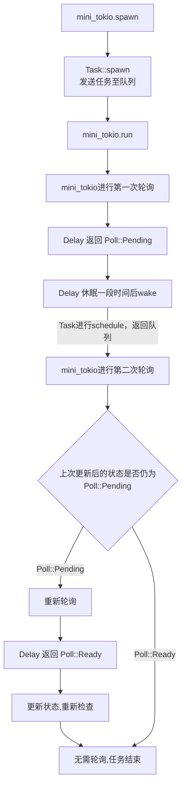

## 0.前言

有关Mini Redis的相关教程网址如下：

中文：[Mini Redis Tokio Tutorial 中文版](https://cakeal.github.io/mini-redis-tokio-tutorial-zh/Intro.html)

英文：[Mini Redis Tokio Tutorial](https://tokio.rs/tokio/tutorial)

由于目前看了有一段时间，仅将**现阶段**开始有所不大理解的地方记录下来。如果后续会去回顾这个教程，会把前面的地方再补上。

本部分所需要的依赖如下：

```toml
[dependencies]
tokio = { version = "1", features = ["full"] }
mini-redis = "0.4"
bytes = "1"
futures = "0.3"
```

## 1. 深入异步章节（Async in depth）

### 1.1 总述

该章节为理解tokio中有关任务的相关机制的运作方式，实现了一个迷你版的tokio，称为**Mini-Tokio**。

在Rust中，异步函数或async块返回一个**实现了Future特征**的结构体。该Future不会立刻执行，直至其使用了.await方法。示例：

```rust
use future::*;
use tokio::*;

async fn hello(){
    println!("Hello,world!");
}

#[tokio::main]
async fn main(){
    //fut为实现了Future这一特征（Trait）的值
    let fut = hello(); 
    //此时上述的println宏不会立刻执行。
    //直至使用.await
    fut.await;
}
```

目前该教程使用了一个Delay结构体负责执行一个打印的定时任务，该Delay实现了Future Trait。以下为具体实现。

```rust
struct Delay{
    //具体执行任务的时间
    when:Instant
}

impl Future for Delay{
    type Output = &'static str;
    fn poll(self: Pin<&mut Self>, cx: &mut Context<'_>) -> Poll<Self::Output> {
        if Instant::now() >= self.when{
            println!("Hello world!");
            Poll::Ready("Done")
        }
        else {
            let waker = cx.waker().clone();
            let when = self.when;
            thread::spawn(move||{
                let now = Instant::now();
                if now < when {
                    thread::sleep(when-now);
                }
                waker.wake();
            });
            Poll::Pending
        }
    }
}
```

上述Delay的实现实际存在一些问题，由于不影响所以先暂时忽略。
该Delay在每次触发任务的时候都会设置一个定时器线程来模拟任务的准备过程。

### 1.2 Mini Tokio

本教程使用Mini Tokio代替具体的tokio库来托管任务的执行。
该Mini Tokio仅实现了tokio的部分功能且不完全。
具体的Mini Tokio的定义如下所示：

```rust
use std::sync::mpsc::{Receiver,Sender};
use std::sync::{Arc,Mutex};
use std::pin::Pin;

struct MiniTokio{
    //等待处理的任务队列
    scheduled:mpsc::Receiver<Arc<Task>>,
    //任务发生器
    sender:mpsc::Sender<Arc<Task>>,
}

struct Task {
    // `Mutex` 让 `Task` 实现了 `Sync`。
    // 在任何给定的时刻只有一个线程可以访问 `task_future`。
    // `Mutex` 不需要在这里有正确性。真正的Tokio
    // 在这里没使用锁，但真正的Tokio有非常多行代码，
    // 放在一篇教程里面写不下。
    task_future: Mutex<TaskFuture>,
    //执行器
    executor: mpsc::Sender<Arc<Task>>,
}

struct TaskFuture {
    //具体的异步任务
    future: Pin<Box<dyn Future<Output = ()> + Send>>,
    //上一次轮询（Poll）后该任务的状态。
    //本教程中一共会出现两种：
    //Poll::Pending：任务还未执行完毕
    //Poll::Ready：任务已经执行完毕
    poll: Poll<()>,
}
```

上述Mini Tokio的实现中使用了mpsc的消息队列进行任务的处理。
具体任务由Task结构体进行封装。
Task结构体中，task_future字段代表需要执行的任务，而
executor字段为具体的执行字段。

为了处理任务，需要对上述结构体定义一系列的方法。相关方法如下所示。

```rust

//---------------- Task相关 -------------------------
impl Task {
    fn schedule(self: &Arc<Self>) {
        let _ = self.executor.send(self.clone());
    }
    fn poll(self:Arc<Self>){
        let waker = task::waker(self.clone());
        let mut cx = Context::from_waker(&waker);
        let mut task_future = self.task_future.try_lock().unwrap();
        task_future.poll(&mut cx);
    }
    // 对于给定的 future 生成新任务
    //
    // 初始化包含给定 future 的新任务结构，推给 `sender`
    // 管道的接收部分会获取到这个任务并执行它。
    fn spawn<F>(future:F,sender:&mpsc::Sender<Arc<Task>>)
    where F:Future<Output = ()> + Send + 'static
    {
        let task = Arc::new(Task{
            task_future: Mutex::new(TaskFuture::new(future)),
            executor:sender.clone(),
        });
        let _ = sender.send(task);
    }
}

impl ArcWake for Task{
    fn wake_by_ref(arc_self: &Arc<Self>) {
        arc_self.schedule();
    }
}

//---------------- TaskFuture相关-------------------------
impl TaskFuture{
    fn new<F>(future:F) -> TaskFuture
    where F:Future<Output = ()> + Send + 'static
    {
        TaskFuture { future: Box::pin(future), poll: Poll::Pending }
    }
    fn poll(&mut self,cx:&mut Context<'_>){
        // 允许虚假唤醒（即本次检查时发现poll字段为Poll::Pending），即使一个 future 已经返回了 `Ready`。
        // 然而，轮询一个已经返回了 `Ready` 的future是*不*被允许的。
        // 对此，我们需要在调用前检查 future 是否仍处于挂起状态。
        // 如果不这样做可能导致 panic 。
        if self.poll.is_pending(){
            self.poll = self.future.as_mut().poll(cx);
        }
    }
}


//---------------- Mini Tokio相关-------------------------
impl MiniTokio{
    fn new() -> MiniTokio{
        let (sender,scheduled) = mpsc::channel();
        MiniTokio { 
            scheduled,sender
        }
    }
    /// 在 mini-tokio 实例上生成一个future
    ///
    /// 给定的 future 被包含在 `Task` 中并被传到 `调度` 队列中
    /// 这个 future 将在调用 `run` 时执行
    fn spawn<F>(
        &self,
        future:F
    )where
        F: Future<Output = ()> + Send + 'static,
    {
        Task::spawn(future,&self.sender);
    }
    fn run(&mut self){
        while let Ok(task) = self.scheduled.recv(){
            task.poll();
        }
    }
}
```

根据上述所写的方法，该Mini Tokio对任务的处理逻辑如下。以该main函数为例：

```rust
#[tokio::main]
async fn main(){
    let mut mini_tokio = MiniTokio::new();
    mini_tokio.spawn(async {
        let when = Instant::now() + Duration::from_millis(10);
        let future = Delay { when };

        let out = future.await;
        assert_eq!(out, "Done");
    });

    mini_tokio.run();
}
```

首先，main函数中创建了一个MiniTokio实例用于管理后续的Future执行。
该new函数初始化了消息队列的发送者和接收者。
而后，main函数中使用了MiniTokio的spawn方法创建了一个任务。
该spawn方法接收一个async块（Future），用于在当前时间10ms后打印字符串，并返回一个字符串引用“Done”。
内部的async块不会立刻执行，直到MiniTokio实例调用了run方法为止。

该MiniTokio内部处理任务的流程如下：

1. 由MiniTokio.spawn方法创建了一个任务。该方法中调用了Task::spawn来创建了一个任务。Task::spawn函数会通过MiniTokio传入的sender实例，将新建的任务发送至消息队列。发送的信息中包含任务的具体内容，以及唤醒时需要的执行器。
2. main函数中调用了MiniTokio.run方法，标志着任务正式开始执行。此时内部会对接收者部分进行循环检查。若MiniTokio实例接收到了一个任务，run方法将对该任务的状态进行轮询（Poll）。
3. 对该任务进行轮询的过程中，需要事先检查此任务上一次的轮询状态（对应TaskFuture中的poll字段）。一个已经处于Poll::Ready（即已完成）的任务是无法进行轮询的。若该任务上一次轮询时仍在执行中（检查后会返回Poll::Pending），则更新任务的poll字段。
4. 在MiniTokio实例对任务轮询的同时，该任务也在异步执行中。此处任务实现为上述的Delay。Delay结束后，会通过上下文（cx）获取到的waker主动唤醒，提示MiniTokio该任务已完成。
5. 由于Task实现了ArcWake特征，当Delay任务调用了waker.wake()方法时，同时也会调用wake_by_ref方法，此时该任务会通过保存的执行器发送任务相关信息表示已完成。
6. MiniTokio实例接收到了完成消息，重新对任务进行轮询。此时发现任务已完成，故停止轮询。任务结束。

由流程图表述如下所示：



以上即为Mini Tokio的运作流程。若有不足后续会继续补充。

### 1.3 关于Delay的缺陷

对于上述Delay的实现，仍然存在一些问题。

由于当前Delay的poll方法为每次poll创建一个新线程，因而，
如果代码中存在对Delay::poll的多次调用（即对Delay的多次轮询），将会导致性能下降。

此外，poll方法使用的唤醒器waker不一定每次都能和当前Delay所处的任务上下文相关联。
这是由于Rust支持异步跨任务执行，故而在每次poll的时候必须要获取到当前上下文的waker，否则会造成无效唤醒。

因此，当前Delay实现需要做出改进，需要在上下文变化时记录当前waker。

```rust
use std::sync::{Arc, Mutex};
use std::task::Waker;
use std::time::Instant;

struct Delay{
    when:Instant,
    //当前上下文的Waker
    waker:Option<Arc<Mutex<Waker>>>
}
```

上述之所以用Option包裹Waker，主要目的是防止过于频繁地创建线程。
若该Delay任务已经被poll过，则waker记录一定不为None，故而不需要额外创建定时器线程。

具体而言，针对上述两个痛点的改进部分如下。

```rust
use std::future::Future;
use std::pin::Pin;
use std::sync::{Arc, Mutex};
use std::task::{Context, Poll, Waker};
use std::thread;
use std::time::{Duration, Instant};

impl Delay{
    fn poll(
        mut self: Pin<&mut Self>, 
        cx: &mut Context<'_>
        ) -> Poll<()> 
    {
        //..跳过
        //----------------改变处 -----------------
        if let Some(waker) = &self.waker{
            //若前面已经被Poll过，则self.waker为Some，否则为None
            let mut waker = waker.lock().unwrap();
            //检查当前上下文的waker是否和所记录的waker一致
            //will_wake方法可以用于进行这种比较
            if !waker.will_wake(&cx.waker()){
                //不一致则更新
                *waker = cx.waker().clone();
            }
        }
        else{
            //第一次Poll
            let when = Instant::now();
            //从当前上下文克隆waker并记录
            let waker = Arc::new(Mutex::new(cx.waker().clone()));
            self.waker = Some(waker.clone());
            thread::spawn(move ||{
                //执行定时任务，略
                //...
                //使用当前上下文的Waker唤醒
                let waker = waker.lock().unwrap();
                waker.wake_by_ref();
            });
        }
        //..跳过
    }
}
```
