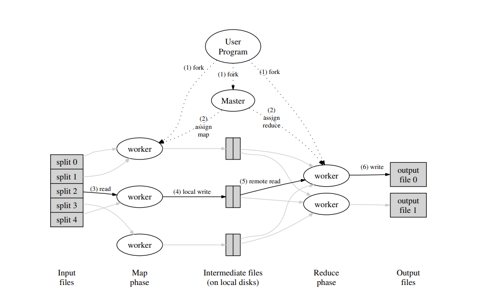

## 前言

本人开始补充分布式方面的知识。此处仅做笔记。
相关课程见[这里](https://pdos.csail.mit.edu/6.824/schedule.html)。

此为本系列的第一部分，即**MapReduce**的学习笔记。

## MapReduce介绍

MapReduce是一种**编程模型**，由Google公司设计[^1]，用于解决集群（Cluster）计算机中大规模数据处理和计算问题。
MapReduce的论文见[这里](https://pdos.csail.mit.edu/6.824/papers/mapreduce.pdf)。

MapReduce旨在在集群机中尽可能地并行化、分布式地派发和计算处理数据的任务，并提高系统整体的容错。该模型内包含两个步骤。

- **映射（Map）**：将输入数据映射为若干**中间键值对**，而后将上述键值对传递给下一步骤。
- **归约（Reduce）**：将上述Map阶段得到的中间键值对进行一定的整合操作，具体而言将具有相同键的值通过某种方式整合成一个更小的集合（该集合中不一定是原中间值，可能经过了某种处理，例如单词统计中需要计算单词总出现次数，而此时的中间值仅为“是否出现”的布尔标记（值为0或1））。

MapReduce在不同场合有着不同的实现，其在处理大量数据的时候有着巨大的作用。

## MapReduce的实现

实现了MapReduce的对象内部具有一定的结构和职责划分。
MapReduce的执行过程如下：

1. MapReduce库首先在用户机中将输入数据分割成$M$份切片（由用户控制份数），并分发到集群机中的各机器。而后分别启动各机器中的MapReduce程序。
2. 在集群机的所有MapReduce程序拷贝中，负责指挥调度、分派任务的部分称为**主节点（Master）**，其余被分派任务的节点称为**工作者（Worker）** 节点。假设一共有$M$个Map任务和$R$个Reduce任务。Master节点将会选择一个处于空闲状态的Worker节点来分配对应任务。
3. 被分配到Map任务的Worker会读取对应的切片，执行Map程序，而后将产生的中间键值对缓存到本地内存中。
4. 上述缓存的中间键值对会周期性地被写入本地磁盘，而后由分区函数将对应的存储区划分为$R$个**区域（Region）**，每一个区域对应一个Reduce任务。而后，这些键值对在本地磁盘中的位置也会传回Master程序，并将其传递给对应的Reduce Worker。
5. 当负责Reduce的Worker获取到由Master传来的键值对位置信息，它将使用**远程过程调用（Remote Procedure Call, RPC）** 来读取位于本地磁盘上的中间键值对。而后，Reduce Worker将读取到的键值对按键**排序**（若键值对个数较多则采用外部归并排序），以便让具有相同键的值聚合到一起。上述分区+排序的过程一般被称为**Shuffle**。
6. 排序完毕后，Reduce Worker迭代键值对列表，将具有相同键的值聚合到一起，并进行某种计算，最终输出到一个文件上。

上述步骤会生成$R$个MapReduce执行结果。一般而言这些结果会被用作其他用途（例如下一个MapReduce程序），因而无需合并到一个文件中。

该类算法的执行示意图[^1]如下所示。

由于Master程序负责总体的调度和任务的分发，因而需要维护各个任务的状态
（一般而言有*闲置（idle）* 、*工作中（in-progress）* 和*已完成（completed）* 三类状态），
以及每个Worker机的标记信息。
此外，当Map Worker完成任务后，Master需要及时更新各Map Worker结果在本地磁盘上的位置、大小等信息。
若有正在执行任务的Reduce Worker，Master将会采取*增量更新*的方法来分发Map Worker产出的结果。

在分布式环境中，网络是一种较为稀缺的资源，MapReduce通过尽量读取本地资源这一方式节约网络开销。
在任务执行伊始，分布式文件系统（如Hadoop的HDFS、Google的GFS）会将输入文件切割成若干块，
而后拷贝多份到集群环境中不同机器的本地磁盘中。
当开始执行Map任务时，Master会尽量调度Map Worker直接读取本地磁盘的数据。
如果该Worker被标注为执行失败，Master则会调度该Worker机器邻近（处于同一网络，或者链路距离较近）的Worker对对应数据进行读取。

若在执行过程中发现有部分机器跑的很慢（这类机器被称为**拖慢者（Straggler）**），MapReduce的Master节点会采取**备份任务**的方式进行解决。
具体而言，当Master发现任务即将完成时，对于当前正在进行的任务会额外调度几个空闲的机器作为备份同时并行跑。
一旦有某一台机器执行完毕，则表明MapReduce任务执行完毕，其余未执行完毕的机器的结果会被丢弃。这样会极大提升任务执行速度。

## MapReduce的容错设计

基于MapReduce的设计目的，该编程模型需要对可能发生的错误进行优雅地处理，即需要具有一定的**容错率（Fault Tolerance）**。

### Worker执行错误的处理

在MapReduce运行过程中，Master会定期对Worker发送ping请求，Worker需要在一定期限内进行ping应答。
若有Worker长时间无法进行ping应答，则Master会将该Worker标记为*执行失败*。
处于*执行失败*状态的Worker所 *完成* 的 *Map任务*，或 *正在进行* 的 *Map和Reduce任务* 将会被**直接重置**为*idle*状态，而后再重新分派到其他Worker上，
已完成的Reduce任务*不需要*重新执行。

对于Map和Reduce的Worker的处理方式有所不同。
当Map Worker变为失败状态时，若其有处理Map任务，则该Worker的Map任务会被重新执行，这是因为Map任务的结果将会被存储到本地磁盘上，
而该Worker机器由于执行失败，其结果变得不可访问。
而由于Reduce Worker的结果存储在全局文件系统中，因而Reduce Worker失败时，其任务不需要被重新执行。

对于一个完整的MapReduce过程，若Map Worker $A$执行任务时失败，其任务被传递到了Worker $B$中，这一信息会
传播到所有依赖于$A$结果的Reduce Worker中。所有暂未从$A$中读取数据的Reduce Worker将会转而从$B$中读取。

基于以上设计，MapReduce可以容忍较大规模的Worker机器出错。

### Master执行错误的处理

对于Master机，一种方法是在执行过程中周期性地保存**检查点（Checkpoint）**，即当前Master的一切状态和上下文等运行相关信息。
而后若Master在某一时刻故障，便可以从保存好的检查点出发进行恢复。
然而，若Master只有一个，此时一般认为Master*不大会出错*，因而在这种情况下如果Master出错则**直接终止MapReduce过程**。

### 结果正确性的保证

对于使用MapReduce的分布式环境，需要通过一定手段保证输出结果的正确性。
根据MapReduce使用的输出函数确定性，分以下情况讨论。

#### 确定性函数的情况

若Map和Reduce都使用**确定性函数（Deterministic Function）**（即给定相同输入就一定能产生相同输出），
那么无论其是否在分布式环境的运行过程中发生了故障，MapReduce的输出和在一个无故障的单机上的运行结果是**等价的**。

MapReduce使用了**原子提交**的方式来保证上述过程的正确性。具体而言分为以下两种处理方式：

- Map任务：Map任务将结果写入$R$个**私有临时文件**中，并在写入完毕后向Master报告私有文件的相关信息（如文件名等）。若Master从一个*已经完成的Map任务*处收到上述消息则主动忽略，否则在自身数据结构中记录这$R$个私有文件的相关信息。
- Reduce任务：Reduce任务首先会将输出写入到一个临时文件，在任务执行完毕后执行**原子重命名**，把临时文件更名为最终的输出文件。如果该Reduce任务被分布到多台机器上，则会对输出临时文件进行多次原子重命名调用，但重命名操作的原子性可以保证最终输出结果只会保留众多执行结果的其中一个。

#### 非确定性函数的情况

大部分情况下，Map和Reduce都会使用确定性函数进行输出，语义较为清晰。
当Map或Reduce采用非确定性函数时，其仍然有一个较弱且合理的语义。

在使用非确定性函数的情况下，对于单个Reduce任务，其输出结果等同于其顺序执行情况下的结果。
但是对于多个Reduce任务而言，其结果未必相同，即其输出结果可能等价于MapReduce**不同批次**的顺序执行结果。

> 例如，假设存在Map任务$M$和Reduce任务$R_1$和$R_2$，其中$M$因故障重试或推测执行而被执行了多次，
> $R_1$读取的可能是$M$第一次重启的输出，而$R_2$读取的是$M$第二次重启的输出。
> 这就导致了$R_1$和$R_2$的输出有所不同

因此，对于非确定性函数的情况，MapReduce的输出可能是**多个运行快照拼凑出的结果**。

## 优化手段

MapReduce可以采取一些优化手段以得到更好地执行结果。例如：

- 特殊的分区函数：针对特定问题使用特定的分区函数（例如Map的输出键为URL时，希望能够整合来自同一主机源的URL），能够提高分区带来的效果。
- 固定的排序顺序：分区后的排序固定为升序或降序。
- 细粒度任务：将当前执行的任务粒度尽可能切细，从而加快单个机器的运行效率，以此提升整体效率。
- Combiner函数：在进行Reduce之前（一般在执行Map任务后，Map结果信息被分派到网络上之前），在Map Worker端使用一个**Combiner函数**将大量相同、相关的键整合为一个，以减少传播到网络上的数据量，从而节省网络开销、提高运行效率。例如词频统计中会产生大量诸如`("the",1)`的键值对，Combiner函数会将其整合为`("the", N)`，其中$N$为单词"the"的出现次数。

[^1]: Jeffrey Dean and Sanjay Ghemawat. 2008. MapReduce: simplified data processing on large clusters. Commun. ACM 51, 1 (January 2008), 107–113. [链接](https://doi.org/10.1145/1327452.1327492)
