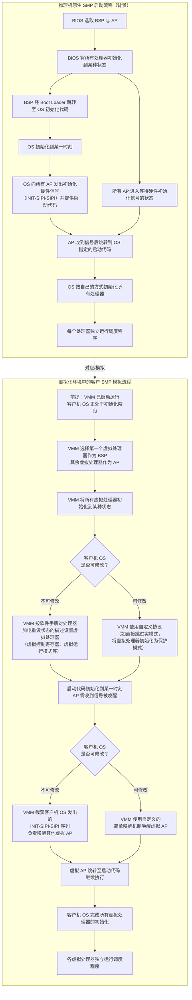
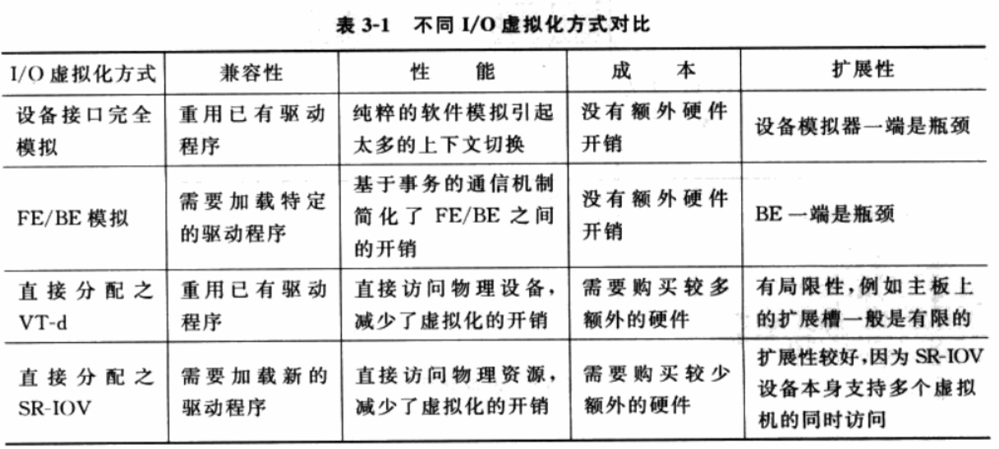
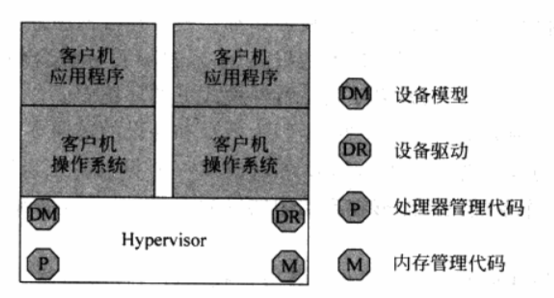
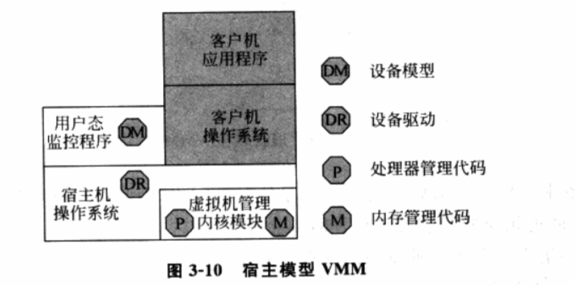
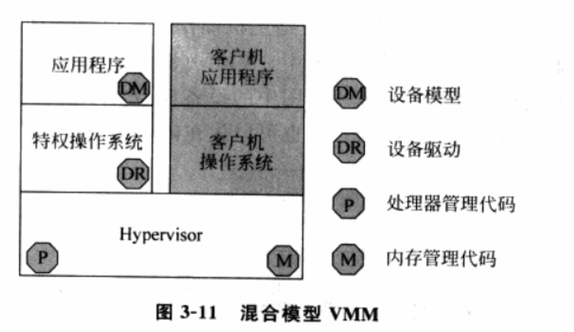

## 前言

这是《系统虚拟化：原理与实现》第三章的读书笔记。
（第二章内容有一大部分接触过，所以如果要补等后面再补）

第三章主要是对虚拟化相关技术和架构的一个概述。

## 可虚拟化架构和不可虚拟化架构

虚拟化实际上做的工作是*欺骗*运行于VMM之上的客户机操作系统，让其认为它们在真实物理硬件上运行。
VMM对物理资源的虚拟化需要完成三个主要任务，即**处理器虚拟化**、**内存虚拟化**和**I/O虚拟化**。
所有的虚拟机需要满足*同质、高效、资源受控*的特征，若不具备这三个特征的任意一种则该虚拟机设计不良。

在虚拟机执行过程中，有一类指令被称为**敏感指令**，即一类会**操纵敏感资源的指令**。
显然，所有的特权指令都是敏感指令，但有一些敏感指令*并不是特权指令*。
客户机OS发出的所有敏感指令都需要在VMM的监控下执行，或者由VMM进行虚拟化实现。

> e.g. 读取一些敏感寄存器如CR3（PTBR，x86的页表基址寄存器）、GDTR的指令，或者读取虚拟机相关配置的指令都是敏感指令。
> 这些指令会将客户机OS运行在虚拟硬件上的事实暴露给客户机OS，使得虚拟机不再安全。

若所有的敏感指令都是特权指令，VMM可以通过**陷入再模拟**的方式进行捕获并虚拟化，
即让VMM运行在最高特权级上，而客户机OS运行在次一级的特权级上。
当客户机OS执行敏感指令时，OS会因为敏感指令触发异常从而陷入到VMM，而后由VMM模拟该指令。

若存在敏感指令不是特权指令，则说明该结构存在**虚拟化漏洞**，VMM无法对相应敏感指令进行捕获并处理。
存在虚拟化漏洞的结构是**不可虚拟化**的，反之则**可虚拟化**。

## 处理器虚拟化

处理器虚拟化是**最核心**的部分。内存虚拟化和I/O虚拟化都基于处理器虚拟化。

### 虚拟处理器及其相关

VMM需要虚拟出一个虚拟处理器为上层OS提供虚拟硬件抽象，
此外还需要虚拟出一系列虚拟寄存器供上层OS使用，模拟出虚拟上下文负责虚拟处理器的调度。
虚拟处理器是一个逻辑上的处理器，它需要包含客户机OS所需物理架构的一切，包括但不限于：

- 指令集合和执行结果。
- 可用寄存器集合。包括通用寄存器和一系列系统寄存器。
- 运行模式。如x86所包含的四种模式（实模式、保护模式等）。
- 地址翻译系统（如多级页表）。
- 保护机制（如段/页保护）。
- 中断/异常机制。

从VMM的角度讲，虚拟处理器是其需要模拟执行的一组功能集合，其负责处理由客户机OS传递下来的一系列指令。
虚拟处理器在执行任务的时候需要保存对应的上下文。
相比物理处理器的上下文，虚拟处理器的上下文还需要存储一系列系统寄存器，
这是因为当客户机OS想要通过敏感指令对处理器相关的寄存器进行访问和修改时，VMM会将其重定位到虚拟处理器。

需要注意的是，VMM可以为虚拟机呈现出与实际物理机*完全不一致*的功能和行为，
如虚拟处理器个数可以与物理处理器个数完全不同。

在处理器虚拟化中，模拟出虚拟处理器等的目的是为了让敏感指令能够被VMM陷入并模拟，而不是直接作用于真实硬件上。
一般而言，VMM的陷入部分是利用了处理器的中断异常机制实现的。具体有以下几种方式：

- **基于处理器保护机制的异常触发**。如客户机OS在当前特权级执行了更高特权级的敏感指令。
- 虚拟机**主动触发的异常（陷阱）**。
- **异步中断**（处理器内部/外部设备中断源）。发生异步中断后会跳到由VMM准备好的处理程序。

### 中断和异常的注入

VMM需要按照物理处理器处理中断和异常的方式，正确模拟出对应的中断和异常处理过程。

VMM会在**硬件异常处理程序**和**指令模拟代码**进行异常虚拟化的检查，而
每次检查都需要区分异常发生的原因。在错误的时机进行异常注入会使得虚拟机执行异常。
具体而言有两类原因：

1. 虚拟机自身环境和上下文设置**违背了指令正确执行的条件**。该类检查主要在虚拟机内部执行。
2. 虚拟机运行在**非最高特权级别**。一般是由*陷入再模拟*导致的。

对于虚拟设备的中断和异常，
由负责模拟虚拟设备的**设备模拟器**负责监视虚拟设备状态，并在满足中断条件的时候通知给虚拟中断控制器
VMM负责监控虚拟中断控制器状态，并在其满足条件的时候模拟中断注入。

若当前中断被禁止注入，VMM会将中断暂时*缓存*起来，直到客户机重新允许注入该中断为止。
如果中断无法被及时注入，VMM还需要进行如下情况的处理：

- 若此类中断**允许丢失中断**，则VMM会将后续的多个*同类型*中断合并为一个，
否则VMM将会监控后续到来的每一个中断并逐一缓存，在条件允许时再逐一模拟。
- 若该中断在**阻塞期间被中断源取消**，则VMM会额外注入一个被取消的假中断。
- （少见）如果一次阻塞的中断实例很多，VMM需要考虑客户机OS能否处理短时间内大量同类型中断注入。

### 对称多处理器（SMP）技术的模拟

VMM在物理计算资源足够的情况下可以为虚拟机模拟出多个虚拟处理器，
这种技术被称为**客户SMP技术**，其可以有效提升虚拟机的性能
（不会提升整体的性能）。

尽管SMP为单个虚拟机带来了性能提升，但也带来了多处理器竞争共享资源等一系列复杂性。
此外，VMM也面临着物理处理器（主机SMP）和虚拟处理器（客户SMP）之间的同步问题。
有如下情况。

- **VMM自身代码之间的同步问题**：VMM负责协调物理处理器步调来满足主机SMP要求。
- **同一虚拟机内部的多个虚拟处理器间的同步问题**：交由客户机OS处理。
- **VMM造成的虚拟处理器之间的同步问题**：由VMM负责处理。

下图展示了客户SMP的模拟流程。从物理机的模拟流程出发，在虚拟化的环境中，由
VMM代替原先的BIOS来选取**BSP（主启动处理器）** 和**AP（应用处理器）**，
而后将二者初始化到某一状态。
和主机SMP的启动流程不一样的是，如果客户机OS可以被修改，
则VMM可以完全使用其自定义的协议进行处理器的初始化和AP的唤醒；
如果客户机OS不可被修改，VMM仅需按照和物理机相同的方式进行启动即可。

## 内存虚拟化

VMM在进行内存的虚拟化的时候，需要保证虚拟化的内存满足以下两点：

1. **内存起始地址是0**。
2. **内存一定是连续的**。

VMM需要某种“欺骗”手段，让各虚拟机认为其所持有的内存满足上述两点要求。

由于满足上述两点的真实物理内存只有一份，因而需要引入一个新的地址空间，
称为**客户机物理地址（Guest Physical Address，GPA）空间**。

如下图[^1]所示，VMM负责分配和管理各虚拟机的物理内存，实际上这些物理内存是
虚构的客户机物理地址空间，客户机OS的指令地址也是客户机物理地址。
客户机OS的每次访存使用的客户机物理地址，是**不能**被直接发送到总线的，
需要由VMM将其转化为宿主机的物理地址才能进行访存。

![内存虚拟化示意图[^1]](image.png)

引入了客户机物理地址空间后，VMM需要考虑两个问题：

1. 给定虚拟机，需要给出**客户机物理地址到宿主机物理地址（Host Physical Address，HPA）之间的映射关系**。
2. **截获客户机对物理内存的访问，并根据映射关系，将其访问地址转换为宿主机物理地址**。

上述的第一个问题，仅需要一个哈希表便可以解决。
实际上，客户机OS的访存要经历两层转换，即
**客户机虚拟地址（Guest Virtual Address，GVA）** --> GPA 和 GPA --> HPA。

第二个问题的实现较为复杂和具有挑战性，也是衡量虚拟机性能最重要的方面。

为了更有效地利用空闲内存，VMM会以小粒度进行内存分配，
这可能会造成虚拟机的物理内存实际上可能是不连续的。

内存虚拟化也实现了整个系统的安全隔离（虚拟机和虚拟机、虚拟机和VMM）。具体而言：

- VMM将虚拟机置于一个和自身**完全不同的地址空间**中运行，或通过**段限制**控制客户机OS的访问空间，
从而避免虚拟机触碰到VMM的状态信息。
- VMM使用特殊的**权限验证**机制来局限住虚拟机的访问空间，保证虚拟机只能访问VMM给定的物理页，
使得不同的虚拟机之间的内存空间相互隔离。
- VMM使用某些硬件技术防止虚拟机利用DMA绕过处理器直接访问目标内存，从而保证了物理内存的权限安全性。

## I/O虚拟化

由于外设资源有限，VMM需要通过I/O虚拟化来对外设资源进行复用，以满足多个虚拟机的I/O需求。

在OS中，驱动程序并不关心设备的具体硬件实现，只要其接口符合定义即可使用。
而I/O虚拟化所需要做的事情也是按照接口规范和定义，使用软件模拟出对应的设备，
VMM负责截获客户机OS的设备访问请求，并进行I/O虚拟化。

I/O虚拟化不需要完整模拟出外设的所有接口，其具体模拟策略取决于客户机OS及VMM。

下文介绍I/O虚拟化所需要的步骤和工作。

### 设备发现

VMM需要提供一种方式使得客户机OS能够发现虚拟设备。设备发现取决于被虚拟的设备类型。

1. 模拟**所处物理总线**的设备。具体包含两种：
    1. 所处总线**不可枚举**，且设备本身**所属资源由硬编码固定**下来（e.g. ISA设备、鼠标、PS/2键盘、传统IDE控制器等）。
    对于这类设备，驱动器会使用设备特定的方式进行设备识别。
    VMM仅需在给定端口进行正确的模拟（设备自身逻辑），驱动程序就可以发现。
    2. 所处总线**可枚举**，且相关设备资源**软件可配置**（e.g. PCI设备）。
    对于这类设备，VMM不仅需要模拟设备自身逻辑，还要进一步模拟设备对应的行为。
2. 模拟**完全虚拟**的设备（e.g. FE/BE模型）。这类设备没有现实中的规范，其总线类型完全取决于VMM的具体实现。
VMM可以使用原有的总线，也可以自定义一套新的总线。
使用原有的总线可以有很好的兼容性，而自定义总线可能可以简化相关复杂模拟，但这意味着需要对自定义总线进行额外维护，
此外自定义总线还可能需要设计一个对应的驱动程序。

### 访问截获

客户机OS发现设备后，会对设备发出访问请求，
此时VMM需要对访问请求进行截获并进行模拟。
截获的原理依然是**陷入再模拟**。分为四类情况讨论：

1. Port I/O（端口I/O，独立编址）：处理器是否能够通过端口I/O访问设备取决于其**特权级别和I/O位图**。
若设备非直接分配给客户机OS，VMM可以将**I/O位图对应位进行关闭**，此时若客户机OS试图访问该端口就会抛出异常，
从而被VMM捕获进行模拟；若设备是直接分配给客户机OS的则不做截获，保持I/O位图对应位，直接发送给系统总线。
2. MMIO：持有MMIO资源的设备，其MMIO是物理地址空间的一部分，这类资源的访问由**页表**控制。
若设备非直接分配给客户机OS，VMM仅需将映射到MMIO的**页表项设为无效**，客户机OS访问该页时就会抛出
缺页异常，进而被VMM捕获，并发现其中的MMIO资源，从而进行模拟。
若设备是直接分配给客户机OS的也不做上述截获操作，按正常流程访问即可。
3. 中断：若设备非直接分配给客户机OS，则由VMM负责物理设备中断的拦截和注入；
否则，由VMM传递该设备的中断源到客户机的虚拟中断逻辑。
4. DMA：VMM只需要提供对应的地址转换关系，使得设备模拟器能够正确映射地址即可。

### 设备模拟

设备模拟的方式主要可以分为以下几类：

- **完全模拟**。即按照物理接口规范使用**软件完全模拟**出一个设备，
此时客户机OS可以复用原有的驱动程序。
由于该方式需要涉及许多寄存器操作，VMM需要不停地截获请求并模拟，
导致上下文开销很大。
- **FE/BE模拟**。这种架构基于请求/事物机制，将驱动程序分为位于**客户机OS**上的**前端（Front End，FE）驱动**
和位于**VMM中**的**后端（Back End，BE）驱动**。客户机OS上的前端驱动截获请求，通过特殊通信机制发送给
后端驱动，后端驱动处理完毕后再返回结果给前端驱动。基于这种方式的上下文开销较小。
- **直接分配设备**。此种方式VMM不需要模拟，客户机OS直接使用原有驱动访问目标设备。

下表[^1]展示了上述不同的设备虚拟化方式的特点。

### 设备复用

VMM可以选择性地进行设备的虚拟化。

- 一部分设备可以完全虚拟化从而不用接触物理设备，如CMOS。
- 一部分设备则需要通过设备模拟器来访问真实物理设备。

对于上述情况的后者，由于设备模拟器通常运行在**I/O特权环境**中，
该环境存在物理驱动，因而其相当于众物理驱动的一个**客户**（用户进程）。
而大多数物理驱动都支持同时接受来自多个进程（客户）的请求，
从而使得设备复用能够实现。

## VMM的功能和组成

VMM需要对虚拟资源和物理资源进行管理。具体而言如下。

### 虚拟资源的管理

VMM需要对其所持有的虚拟资源进行分配和管理。其需要包含的基本模块有

- 处理器虚拟化模块
- 内存虚拟化模块
- I/O虚拟化模块

此外，VMM需要有对虚拟机资源进行调度的能力，以及能够让虚拟机间进行通信的能力。
VMM对用户也需要暴露出管理接口，以方便管理虚拟机生命周期以及调整虚拟机相关配置。

### 物理资源的管理

VMM也承担全部或部分物理资源管理的职能，因实现而不同。
具体而言一般包括处理器管理、内存管理、I/O管理、设备管理和系统时间维护等。

### 其他模块

除以上提及部分，VMM还可以提供的模块有

- 软件定时器
- 多处理器同步机制
- 调试工具
- 性能采集和分析
- 安全模块
- 电源管理

## VMM的分类

VMM一般有如下两种分类方法。

### 按虚拟平台分类

在这种情况下，VMM主要分为以下两种类型。

1. **完全虚拟化（Full Virtualization）**，
指采用某种方式模拟出一套**完整的物理平台（处理器、内存、I/O等）**，客户机OS**无需修改**就可以**直接运行**在VMM上，
这类VMM的运作方式和底层硬件完全一样。根据发展历史，该类虚拟化技术还可以分为以下两种：

     1. **软件辅助的完全虚拟化**。早期硬件（如x86）**不存在**对虚拟化的支持，因而只能全部使用软件模拟。
     一个典型做法是使用**优先级压缩（Ring Compression）** 和**二进制代码翻译（Binary Translation，BT）** 相结合。
     其中：
        - 优先级压缩：让VMM运行在Ring 0（最高级），客户机OS运行在Ring 1（次一级），因而
        所有的特权指令都能被截获，但有部分敏感指令不会因为权限问题而被截获。
        - BT技术：将对虚拟化不敏感的指令翻译为虚拟化敏感的指令（块）。

        尽管如此，这类打补丁的方式所实现的VMM很难在架构上保持完整性，即总会有补丁难以覆盖的地方。
        并且补丁之间可能会相互冲突。此外，由于补丁修改了指令行为，导致所呈现出的架构不完整。
     2. **硬件辅助的完全虚拟化**。通过在硬件添加支持虚拟化的机制，从而VMM可以通过硬件截获敏感指令来进行模拟。
     这是一种**完备的**虚拟化方法，VMM可以模拟一个和真实主机**完全一样**的环境。
     该部分的代表性技术为**Intel的VT-x**。
2. **类虚拟化（Para-Virtualization）**。这类虚拟化技术是通过**修改操作系统内核源代码**，
使得难以虚拟化的指令能够得以规避，从而让整个架构得以被虚拟化。
由于对源代码进行了修改，这种方式还可以进行I/O的优化，使用更加高效的协议代替原本的协议。

### 按实现结构分类

具体而言可以被分为如下三类：

1. **Hypervisor模型**。在该模型中，VMM可以看作一个完备的操作系统，其**同时管理**上层的虚拟资源和下层的物理资源。\
由于其直接管理物理资源，在资源分配方面效率很高。
但是其需要对设备驱动重新实现以支持I/O，开发量巨大。
此外其也需要对一系列资源管理相关功能进行重新实现，工作量大。
\
下图[^1]展示了Hypervisor模型。（其中，设备模型用于I/O虚拟化）
\

2. **宿主模型**。这个模型下，VMM是**内嵌于宿主机操作系统的一个子模块**，
这意味着VMM可以充分利用宿主机OS的资源，包括设备驱动、调度机制等，
但是VMM的运行效率也会相对低下，且VMM的安全性完全受宿主机OS的影响。
\
下图[^1]展示了宿主模型。
\

3. **混合模型**。这是上述两种模型的汇合体，VMM掌控所有的物理资源，但是
其**大部分I/O设备控制权**都让渡给了运行在**特权虚拟机**中的**特权操作系统**。
VMM虚拟化方面的工作也被拆分：处理器和内存虚拟化由VMM全权进行，而I/O虚拟化由VMM和特权操作系统共同合作完成。\
混合模型具有上述两种模型的优点，但是也存在缺点。
由于特权操作系统运行在用户态，这意味着VMM和特权操作系统的交互存在上下文切换开销，当切换较频繁的时候会影响性能。
此外，一部分功能必须在VMM中实现（e.g. 电源管理），无法借助特权操作系统。
\
下图[^1]展示了混合模型。
\

## 典型虚拟化产品

截至书[^1]的出版时间，所提及的VMM产品主要有

非开源的：

- VMware系列：如VMware ESX Server（Hypervisor）、VMware Workstation（宿主）等。
- Microsoft虚拟化产品：Virtual Server（宿主）、Virtual PC（宿主）等。

开源的：

- Xen[^2]（混合）
- KVM[^3]（项目发起人和维护人认为是Hypervisor）
- VirtualBox[^4]（宿主）

[^1]: 《系统虚拟化：原理与实现》
[^2]: Xen Project - Open Source Virtualization:[Link Source](https://xenproject.org/)
[^3]: KVM: [Link Source](https://linux-kvm.org/page/Main_Page)
[^4]: VirtualBox: [Link Source](https://www.virtualbox.org/)
